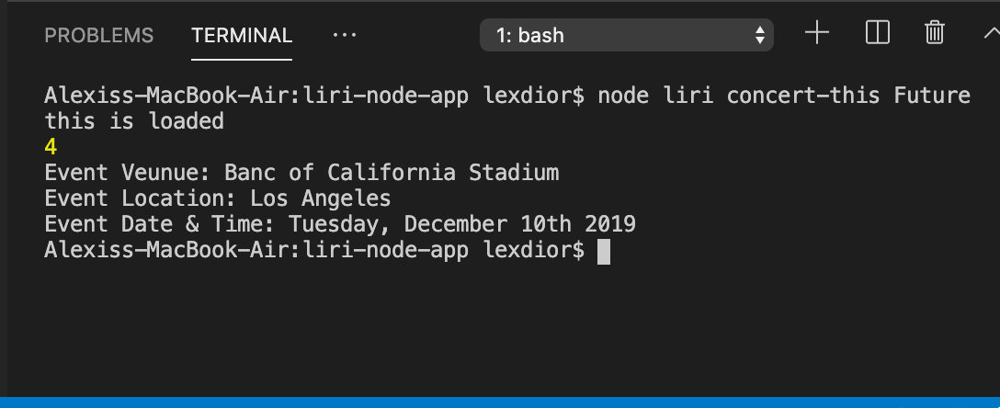
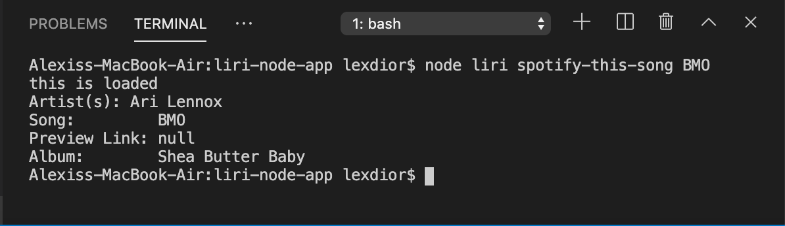
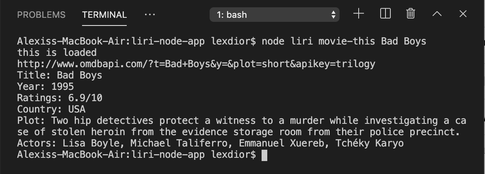

# liri-node-app

LIRI BOT

LIRI is a Language Interpretation and Recognition Interface. LIRI is a command line node app that takes in information and gives back data. The user will have the option of using four commands (listed below) in conjuntion with specific parameters associated with the commands. The Commands are:

concert-this

spotify-this-song

movie-this

do-what-it-says

node liri.js concert-this '' - This will return upcoming concert information from Seatgeek.

node liri.js spotify-this-song '' - This will return song information from Spotify.

node liri.js movie-this '' - This will return information about movies from OMDB.

node liri.js do-what-it-says - This will run a specific command that is stored in a text file.

HOW TO USE LIRI BOT

Open your terminal.

Navigate to the folder that contains the liri.js file.

Depending on the command you run, the output will vary.

Example 1: Run the node liri concert-this command, followed by the name of a specific band or artist.

Example 2: Run the node liri spotify-this-song command, followed by the name of specific song.

Example 3: Run the node liri movie-this command, followed by the specific name of a movie.

Example 4: Run the node liri do-what-it-says command.

